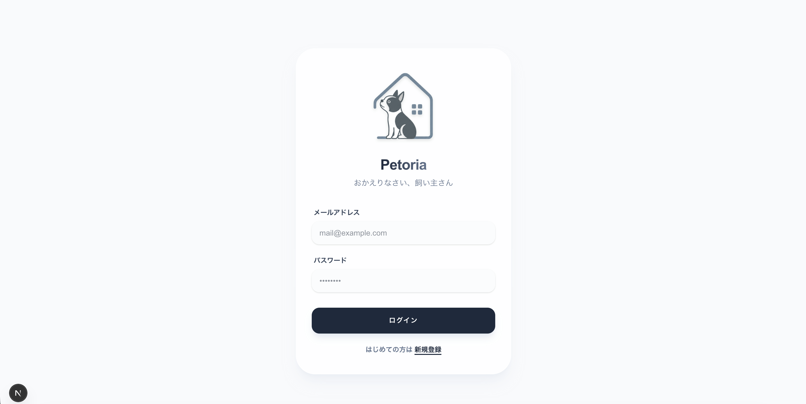
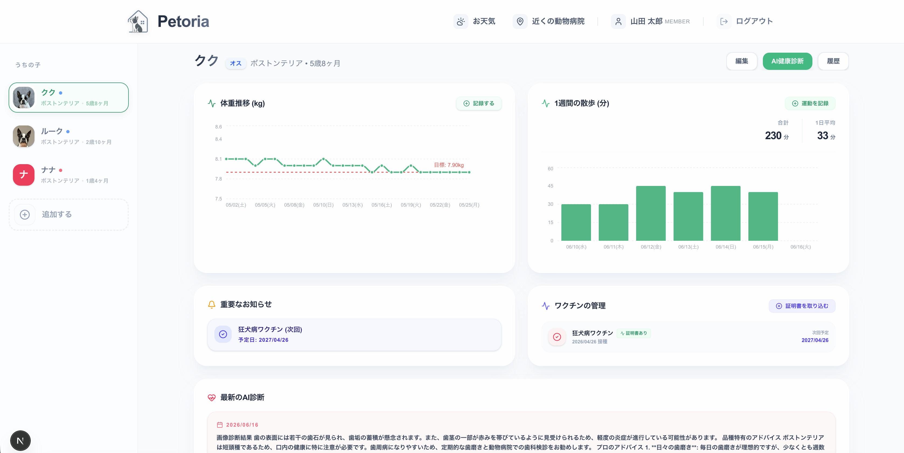
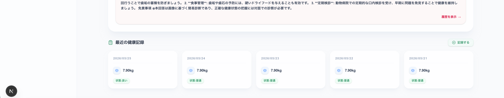
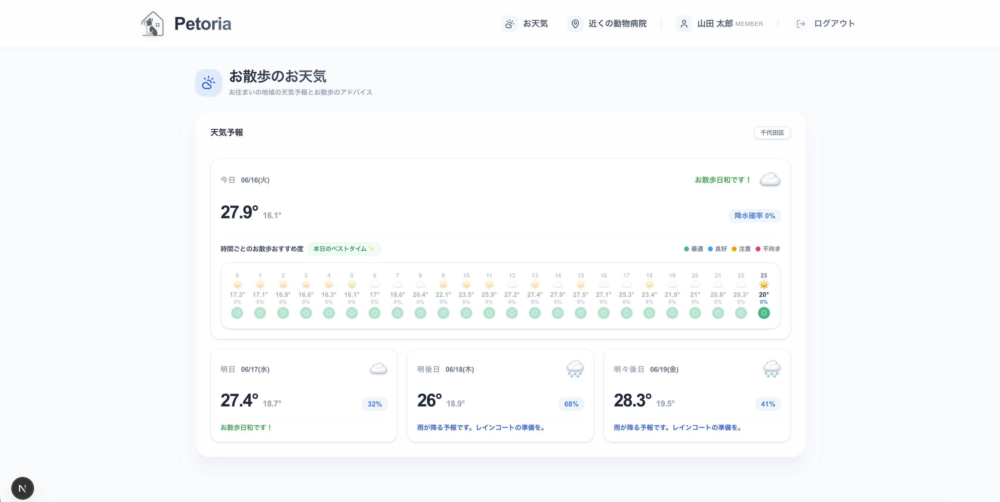
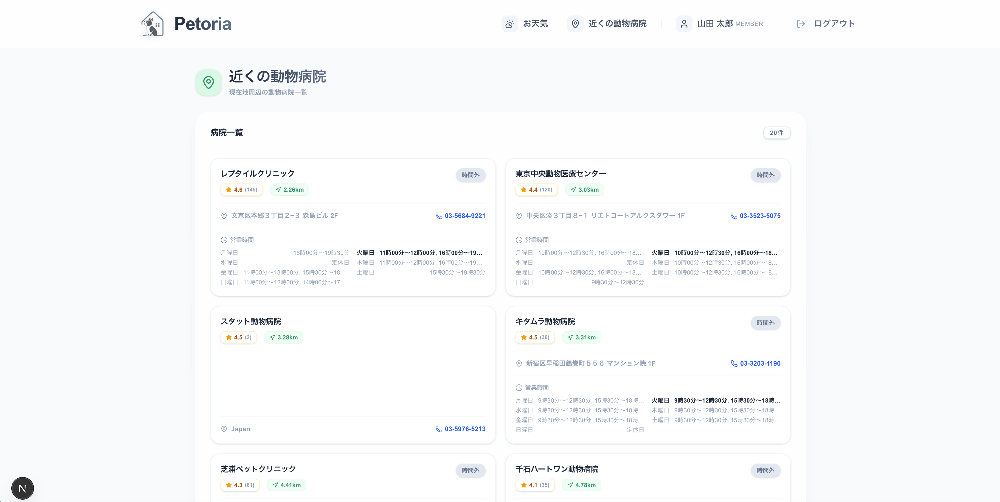
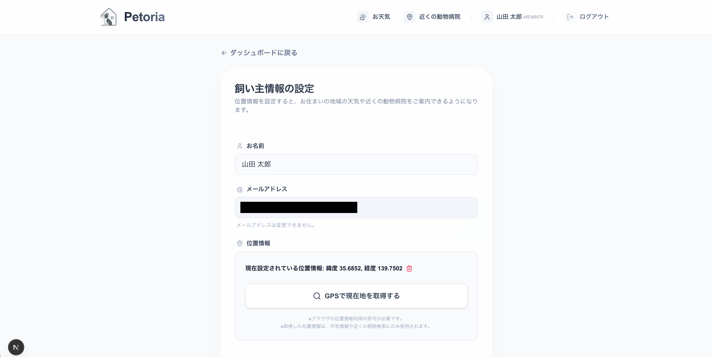
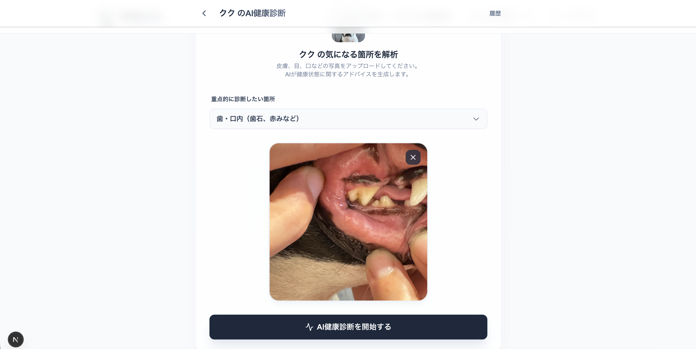
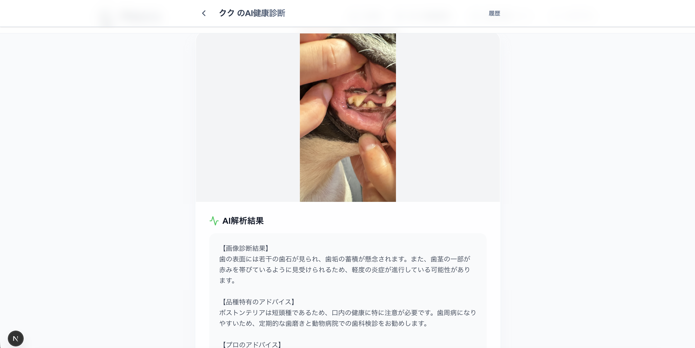
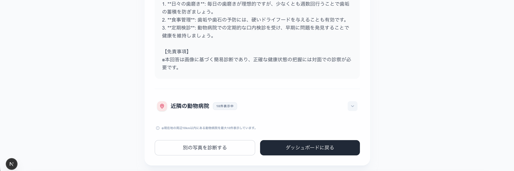
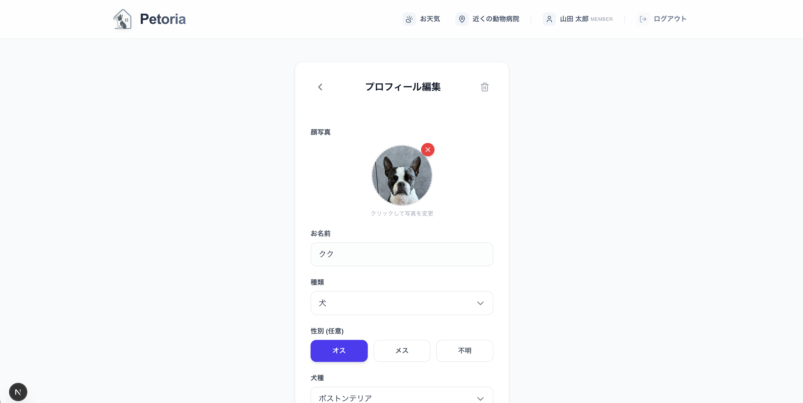

# Petoria (ペトリア)

大切なうちの子の健康と成長を家族みんなで見守る、うちの子健康管理アプリケーションです。

「Petoria」という名前には、「 Pet（ペット）」＋「historia（歴史・記録）」という意味が込められています。  
大切な家族であるうちの子の一生を記録し、共に歩む歴史を大切にしたいという想いから生まれました。

## アプリ画面紹介

### ログイン


### トップ



### お散歩のお天気


### 近隣の病院


### マイページ


### AI健康診断




### ペット



## 機能概要
- **ユーザー認証**: Laravel Breeze (API) による会員登録、ログイン機能。
- **ダッシュボード**: うちの子ごとの体重推移グラフ、散歩時間統計、ワクチン接種リマインダーを表示。最新の診療明細や健康診断結果も確認可能。
- **うちの子管理**: 複数のうちの子のプロフィールを登録・管理。
- **健康記録**: 体重、食事量、排泄状態、散歩時間などの日々の記録管理。
- **医療イベント管理**: ワクチンや予防薬の予定管理。
- **AI健康診断**: 気になる箇所の写真を撮影し、AI（OpenAI GPT-4o）によるアドバイスを受信。
- **AI解析機能**: 
  - **診療明細解析**: 写真から病院名、日付、金額、明細項目を自動抽出。
  - **健康診断解析**: 検査結果表から数値や基準値を自動抽出。
  - **ワクチン証明書解析**: 証明書から接種日や病院名を自動抽出。
- **履歴管理**: 全ての記録（健康記録、AI診断、診療明細、健康診断、ワクチン）を一覧表示。複数選択による一括削除にも対応。

## 技術スタック
- **フロントエンド**: Next.js 15 (TypeScript), Tailwind CSS, Recharts, SWR, Lucide React
- **バックエンド**: Laravel 11 (PHP 8.4)
- **データベース**: MySQL 8.0
- **AI**: OpenAI API (GPT-4o)
- **インフラ**: Docker / Docker Compose

## 開発環境の構築

### 前提条件
- Docker / Docker Compose
- OpenAI API キー (解析機能の利用に必要)

### 手順
1. リポジトリをクローン
2. 環境変数の設定
   `backend/.env` に `OPENAI_API_KEY` を設定してください。
3. コンテナのビルドと起動
   ```bash
   docker compose up -d --build
   ```
4. バックエンドの初期設定
   ```bash
   docker compose exec backend composer install
   docker compose exec backend php artisan key:generate
   docker compose exec backend php artisan migrate
   ```
5. フロントエンドの初期設定
   ```bash
   docker compose exec frontend npm install
   ```

### アクセス
- **Frontend**: [http://localhost:3000](http://localhost:3000)
- **Backend (API)**: [http://localhost:8000](http://localhost:8000)

## 設計書
詳細な設計については [design_document.md](./design_document.md) を参照してください。